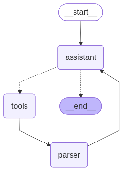

# RICHARD - Agente de finanzas personales

_**R**eceptor de **I**nformación de **C**onsumos **H**umanos para **A**dministración y **R**egistro del **D**inero_

---

El presente proyecto (MVP) es un agente conversacional de finanzas personales. Está construido con **LangGraph**, arquitectura ReAct, y usa **Google Gemini 2.5 Flash** como LLM.
El agente permite al usuario, mediante lenguaje natural en español:

- **Registrar gastos** en una base de datos CSV (`agregar_gasto`)
- **Consultar y analizar gastos** mediante código Python generado por el LLM (`consultar_con_codigo`)
- **Generar gráficos** personalizados con matplotlib/seaborn (`generar_grafico_con_codigo`)

### Interfaces disponibles

**CLI** `main.py` / `ui.py`: Terminal interactiva con **Rich** para el renderizado en Markdown, colores, paneles estilizados y spinners de carga mientras se espera la respuesta. Capaz de mostrar gráficos inline.
**Bot de Telegram** `telegram_bot.py`: Bot conversacional con soporte de imágenes para los gráficos generados. Es el uso ideal del agente.
**MCP Server** `mcp_server.py`: Expone tools, resources y prompts vía MCP (STDIO)
**A2A Server** `a2a_server.py`: Servidor Agent-to-Agent (JSON-RPC 2.0, puerto 9000) para que pueda delegarse a RICHARD tareas de finanzas personales.

El sistema se integra con **Langfuse** para observabilidad y trazabilidad de las interacciones con el agente.

**Stack:** Python 3.12, LangGraph, LangChain, Google Gemini 2.5 Flash, Pandas, Matplotlib, Seaborn, Rich, python-telegram-bot, MCP SDK, A2A SDK, Langfuse.

## Arquitectura ReAct del Agente



---

## Estructura del proyecto

```bash
richard/              # Paquete core del agente
├── agent.py          # Grafo ReAct (LangGraph), nodos, estado
├── tools.py          # Herramientas: agregar_gasto, consultar, graficar
├── config.py         # Configuración centralizada (paths, API keys)
├── prompts.py        # System prompt del LLM
└── __init.py__       # Exports públicos
```

main.py               # Entry point CLI
ui.py                 # Interfaz de terminal con Rich
telegram_bot.py        # Bot de Telegram
mcp_server.py          # Servidor MCP
a2a_server.py          # Servidor A2A


---

## Cómo correr

### Configuración

Copiar `.env.example` a `.env` y completar las API keys:
```bash
cp .env.example .env
```

CLI
```bash
uv run main.py
```

Telegram Bot
```bash
uv run telegram_bot.py
```

MCP Server
```bash
uv run mcp_server.py

```

A2A Server
```bash
uv run a2a_server.py
```

---

*Nota:* Existe la intensión de agregar las siguientes features en el futuro:

| **Migración de CSV a SQLite** | Reemplazar el almacenamiento CSV por una base **SQLite**. Mejora rendimiento, concurrencia, y habilita queries complejas nativas. Especialmente relevante ahora que el bot de Telegram soporta múltiples usuarios.                                                                                                        |
| ----------------------------- | -------------------------------------------------------------------------------------------------------------------------------------------------------------------------------------------------------------------------------------------------------------------------------------------------------------- |
| **Análisis de imágenes**      | Integrar un VLM o utilizar la funcionalidad de Gemini para poder analizar Recibos y registrar el gasto a partir de eso.                                                                                                                                                                                        |
| **Alertas de presupuesto**    | Definir **topes mensuales por categoría**. El agente avisa proactivamente cuando el usuario se acerca o supera el límite definido.                                                                                                                                                                             |
| **Gastos recurrentes**        | **Permitir registrar gastos recurrentes** (ej: alquiler, streaming, servicios) que se agregan automáticamente cada mes, reduciendo la carga manual del usuario.<br>*Nota:* debería consultar al principio de mes sobre los mismos para corroborar si no hubo cambios de monto o si siguen estando por ejemplo. |
| **Agregar nuevas categorías** | Permitir al usuario agregar nuevas categorías (incluso subcategorías con un campo extra). Se podría hacer fácilmente agregando un parámetro opcional a `agregar_gasto` y ajustando la validación `nueva_categoria: bool = False,`                                                                                                        |
